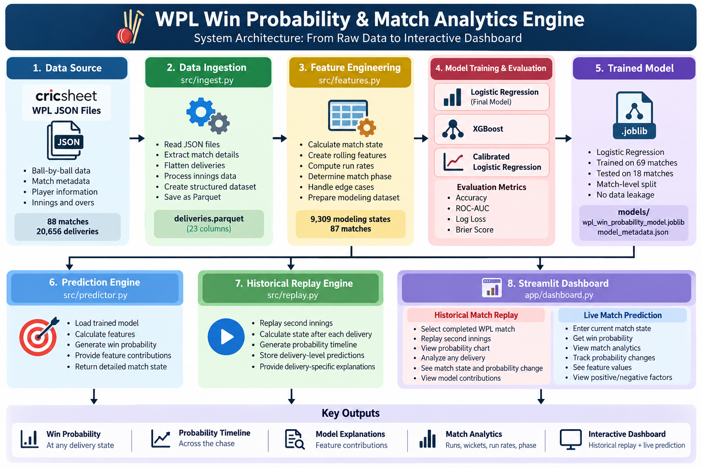

# 🏏 WPL Win Probability & Match Analytics Engine

An end-to-end machine learning system that predicts the win probability of a batting team during a Women's Premier League (WPL) limited-overs chase.

The system combines:

- Ball-by-ball cricket data
- Feature engineering
- Machine learning
- Probability calibration analysis
- Historical match replay
- Delivery-level analytics
- Model explainability
- Interactive Streamlit dashboard

---

## 🎯 Project Objective

The goal of this project is to answer:

> **"Given the current state of a WPL chase, what is the probability that the batting team will win?"**

For every point during the second innings, the model considers factors such as:

- Runs scored
- Runs required
- Balls remaining
- Wickets in hand
- Current run rate
- Required run rate
- Recent scoring momentum
- Match phase

The system then produces a win probability for the batting team.

---

## 📊 Dataset

The project uses ball-by-ball match data from **Cricsheet**.

### WPL Dataset

- Matches processed: **88**
- Deliveries processed: **20,656**
- Modeling matches: **87**
- Binary win/loss target used for modeling
- One tied match decided by a Super Over was excluded from binary target modeling

The raw JSON files are not included in the repository.

---

## 🏗️ System Architecture

```text
                ┌─────────────────────┐
                │   Cricsheet WPL     │
                │    JSON Dataset     │
                └──────────┬──────────┘
                           │
                           ▼
                ┌─────────────────────┐
                │   Data Ingestion    │
                │     ingest.py       │
                └──────────┬──────────┘
                           │
                           ▼
                ┌─────────────────────┐
                │ Processed Parquet   │
                │    deliveries       │
                └──────────┬──────────┘
                           │
                           ▼
                ┌─────────────────────┐
                │ Feature Engineering │
                │     features.py     │
                └──────────┬──────────┘
                           │
                           ▼
        ┌─────────────────────────────────────┐
        │        Model Training & Evaluation  │
        │                                     │
        │  Logistic Regression                │
        │  XGBoost                            │
        │  Calibrated Logistic Regression    │
        └──────────────────┬──────────────────┘
                           │
                           ▼
                ┌─────────────────────┐
                │ Final ML Model      │
                │ Logistic Regression │
                └──────────┬──────────┘
                           │
              ┌────────────┴────────────┐
              │                         │
              ▼                         ▼
     ┌─────────────────┐       ┌──────────────────┐
     │ Prediction      │       │ Historical Replay│
     │ predictor.py    │       │ replay.py        │
     └────────┬────────┘       └────────┬─────────┘
              │                         │
              └────────────┬────────────┘
                           ▼
                ┌─────────────────────┐
                │ Streamlit Dashboard │
                │    dashboard.py     │
                └─────────────────────┘

## 🏗️ System Architecture

                